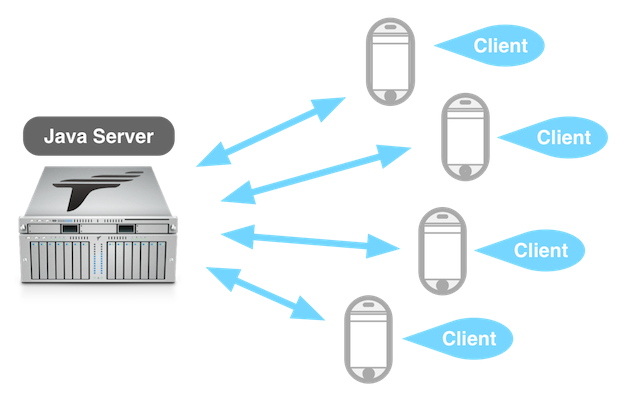
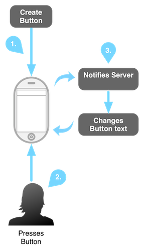
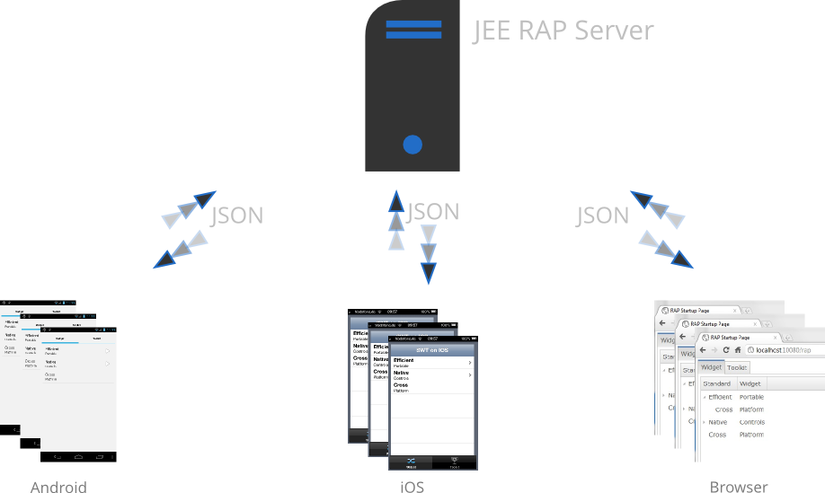

## Anatomy of a Tabris Application

If you have followed the Creating a new application tutorial you will have noticed that a Tabris application consists of two parts: A server and a client. Here we will dig deeper and explain why this has to be as it is.

- Anatomy of a Tabris Application from 100,000 Feet
- Anatomy of a Tabris Application from 10,000 Feet
- Anatomy of a Tabris Application from 1,000 Feet
- Anatomy of a Tabris Application from 100 Feet

## Anatomy of a Tabris Application from 100,000 Feet

Tabris applications will be written using plain Java. Multiple clients can connect to a server and display a UI using native facilities. Out-of-the-box each Tabris application is a cross-platform application!

## Anatomy of a Tabris Application from 10,000 Feet

A Tabris Application is just a simple Java web application. It will be packaged as a .war and deployed to any servlet container. Within this application, a Java Servlet will be registered that marks the entrypoint of an application.

This entrypoint can be accessed by a Tabris client e.g. iOS or Android. The Servlet transfers messages to the client that contains a description of the UI. The client interprets those messages and creates the UI using its native facilities e.g. buttons, labels and so on.

After the UI was rendered a user can interact with it. If the user e.g. presses a button, the client notifies the server that the button was clicked. This event will be processed on the server and the result will be sent back to the client. This result contains UI updates e.g. change of the text of the button.

This round trip is known as **the lifecycle of a Tabris application**. You always need to remember that user interactions will be processed on the server which sends UI updates.

## Anatomy of a Tabris Application from 1,000 Feet

In the last paragraph, we are saying that Tabris Applications are just Java web applications, they do process events and send messages. To realize all this, Tabris is built on top of a well-known open source framework, namely the [Eclipse Remote Application Platform (RAP).](https://eclipse.org/rap/) From an architectural point of view, Tabris sits on top of Eclipse RAP and enhances it to be able to handle mobile clients. As a result, you will get a third platform for free when using Tabris, this is the browser.

A Tabris/RAP Applications uses JSON over HTTP to realize the client/server communication. The messages that create and update the UI are just JSON messages the can be created/understood by the server and the client. The different clients - iOS, Android and browser are using native facilities to render those messages:

- **iOS:** Objective-C with Cocoa Touch
- **Android:** Java with Android Widgets
- **Browser:** JavaScript and HTML5

So, to sum it up Tabris/RAP provides an abstraction for UIs. This abstraction is a Java-API that can be used to code the UI. The API we use for this is not a special/new API. We simply use the Standard Widget Toolkit (SWT) as the Widget Toolkit for Tabris/RAP applications.

As you might see, to write Tabris Applications you don’t need to know much about Tabris itself. The things you need to know well are:

- **Eclipse RAP:** [RAP Documentation](https://eclipse.org/rap/documentation/), [RAP Developer Guide](https://eclipse.org/rap/developers-guide/), [Blog](https://eclipsesource.com/blogs/tag/rap/), [Twitter](https://twitter.com/eclipserap), [Professional Support](https://eclipsesource.com/services/developer-support/)
- **Eclipse SWT:** [SWT Documentation](https://eclipse.org/swt/docs.php), [The Book](https://my.safaribooksonline.com/9780321256638?portal=informit), [SWT Examples](https://eclipse.org/swt/examples.php)

## Anatomy of a Tabris Application from 100 Feet

As mentioned in the previous paragraph Tabris uses JSON messages to realize the client/server communication. These messages are standardized and follow the rules of the [open RAP protocol](https://wiki.eclipse.org/RAP/Protocol). This enables you to write your own client against a Tabris Server. Every technology that can do HTTP and understand JSON can be a potential Tabris client e.g. BlackBerry, Windows Phone, ATM, Unix shell with ncurses and many more.

The JSON messages consist of operations. These operations are e.g. create, set, notify and so on. They contain the information a client needs to display/handle a UI, e.g. create a button, set a button's text.
