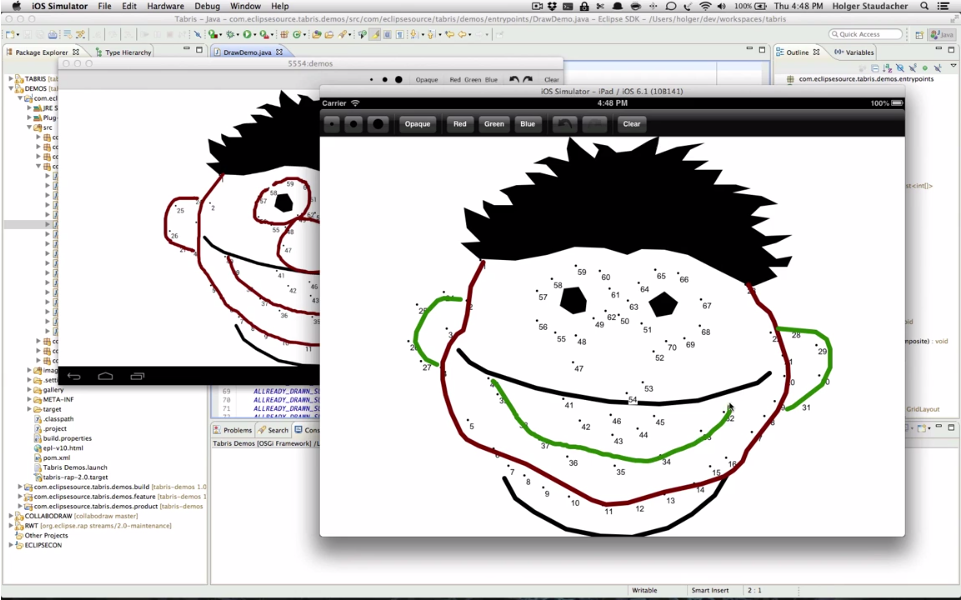

## Client Canvas

To realize drawing you can use the `Canvas` in Tabris and SWT. But sometimes it would be nice to let the user draw something. For this reason, we have created the `ClientCanvas`. It works like a normal `Canvas` with the difference that when the user draws, it's drawn on the `Canvas` directly. As a result, all drawings are present on the server side object.



## Receiving Drawings

In many cases you want to get notified when the user has drawn on the `ClientCanvas`. For this reason you can register a `ClientDrawListener` that will get notified when a drawing happens. To see how to register such a listener, take a look at the snippet below:

```
ClientCanvas canvas = new ClientCanvas( parent, SWT.NONE );
canvas.addClientDrawListener( new ClientDrawListener() {

  @Override
  public void receivedDrawing() {
    // do something
  }
} );
```

## Demo

A simple demo how to use the `ClientCanvas` can be found on [github](https://github.com/eclipsesource/tabris-demos/blob/master/com.eclipsesource.tabris.demos/src/com/eclipsesource/tabris/demos/entrypoints/DrawDemo.java).
