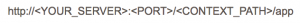

## Creating a new Application

To get started with creating a Tabris application, you should consume Tabris from the p2 repository, available on the [download page](downloads.md).  The following sites can be used to consume Tabris as an Eclipse Target Platform:

- **release:** `https://download.eclipsesource.com/technology/tabris/downloads/releases` Contains all the latest releases.
- **staging:** `https://download.eclipsesource.com/technology/tabris/downloads/staging` Can be used as a stable target. We will not purge any version. Contains picked nightly builds.
- **nightly:** `https://download.eclipsesource.com/technology/tabris/downloads/nightly` Contains the last 10 nightly builds.

## Installing a Tabris target

1. First, create a project to host your target definition files. (File > New > Project > General > Project).
2. In this new project, create a new target definition: File > New > Other > Plug-In Development > Target Definition. Chose a name like Tabris-2.0.target and press Finish.
3. The target editor will open and show the contents of this target definition. Now, you must add the runtimes from a p2 repository (a “software site”). Press Add, select Software Site. Another dialog will show up, named Add Software Site.
4. Again press Add and enter the URL of the stable repository.
5. Select Tabris and Tabris SDK and uncheck the “Include required software” checkbox.
6. Activate the target platform by clicking the link Set as Target Platform in the upper right corner of the target definition editor.
7. After you have set up the target platform, create your application and deploy the .war to a servlet container of your choice, e.g., [Tomcat 7](https://tomcat.apache.org/tomcat-7.0-doc/deployer-howto.html). The application will be available using this URL:

CONTEXT\_PATH is usually the name of the .war.

Now it’s time to [run a mobile client.](running-a-mobile-client.md)
