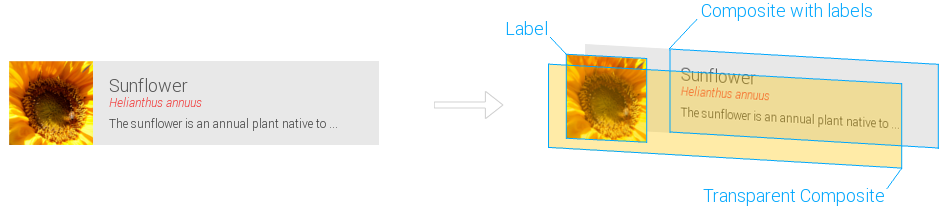

## Grouped Events

A common use case is to group some widgets to visualize a more "advanced" control. This is known as composition. There is only one problem with the composition. You can't handle the composed control as a unit. E.g., if you have combined a Composite and a Label you probably want to react on events for the whole composition. So, one solution is to register event handlers for all used widgets. The problem with this is that a user might touch on the widget and releases his touch on another. This does not throw the correct event. To solve this problem, we have introduced `Grouped Events` in Tabris.

## Widgets.onComposite( ... ).addGroupedListener( ... )

Grouped Events are not only made for mobile clients. They can even be used within the web client because they use SWT only. The idea with grouped events is the following: Create a transparent Composite above the composed control. This does eliminate the problem described above.



You don't have to create this on your own. You can just use the `Widgets` API for this:

_Please note: the composite you use needs to have either a_ `GridLayout` _or_ `RowLayout`.

```
Widgets.onComposite( composite ).addGroupedListener( SWT.MouseUp, new Listener() {

  @Override
  public void handleEvent( Event event ) {
    // do something
  }
} );
```
