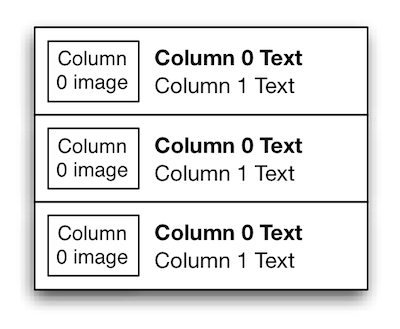
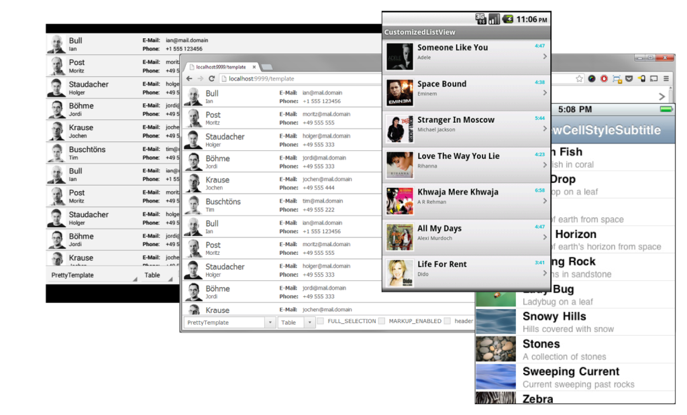

## List Styling

In Tabris you can use the `SWT Table` or `Tree` to visualize lists. One special behaviour here is that per default we only support 2 columns. The list items will be displayed as in the image below.



This fits many use cases, but you will often need to have a more styled list. With a more styled list, we mean something like in the screens below.



In Tabris and RAP, you can realize those lists using a `Template` API.

## Creating a Template

To realize custom styled list, you need to attach a `Template` to a `Tree` or `Table`. A Template consist of `Cells` that can be freely arranged. A `Cell` can display a text or an image from the table/tree item, but also static content.

To position a cell, you have to set exactly two horizontal and two vertical dimensions (two out of left, right and width, and two out of top, bottom and height). Here's a code example that creates a template with two cells:

```
Template template = new Template();

ImageCell imageCell = new ImageCell( template );
imageCell.setBindingIndex( 0 ); // bind to image from column 0
imageCell.setTop( 4 ).setLeft( 4 ).setWidth( 48 ).setHeight( 48 );

TextCell nameCell = new TextCell( template );
nameCell.setBindingindex( 1 ); // display text from column 1
nameCell.setLeft( 60 ).setWidth( 180 ).setTop( 30 ).setBottom( 8 );
nameCell.setHorizontalAlignment( SWT.LEFT ); // left-align the text in this cell
nameCell.setFont( font );
...
```

## Applying a Template

To apply a row template on a `Table` or a `Tree`, you need to use the `setData()` method with the constant `RWT.ROW_TEMPLATE` as key:

```
Table table = new Table( parent, SWT.FULL_SELECTION );
// Add as many columns as needed to add multiple texts/images to items
new TableColumn();
...
table.setData( RWT.ROW_TEMPLATE, template );
```

The call to `setData()` must be placed directly after the control's creation. Once a template is applied to a control, the control will not be affected by changes to the template.

## React on Cell Selections

In some list you maybe want to react on cell clicks, e.g. a play or pause image. For this reason cells can also be selectable. When a selectable cell is clicked on, this click does not select the item, but triggers a selection event with the `event.detail` field set to `RWT.CELL`. If multiple cells in a template are selectable, cells can be given a name that is reflected in the `event.text` field in order to identify the selected cell. To see how to react on such events see the snippet below:

```
Template template = new Template();

ImageCell imageCell = new ImageCell( template );
imageCell.setBindingIndex( 0 );
imageCell.setLeft( 0 ).setTop( 0 ).setBottom( 0 ).setWidth( 60 );

imageCell.setName( "myCell" );
imageCell.setSelectable( true );
tree.addSelectionListener( new SelectionAdapter() {
  public void widgetSelected( SelectionEvent e ) {
    if( e.detail == RWT.CELL && "myCell".equals( e.text ) ) {
      // your cell was clicked
    }
  }
} );
```
