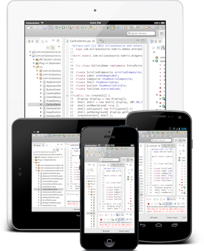

_If you don't have an existing Eclipse RAP application just skip this chapter._

## Migrate an existing RAP Application

Tabris Applications are enhanced RAP Applications. This is the reason why Tabris depends on RAP. If you have an existing RAP Application, this means that you will need to add one additional jar file. It's called `com.eclipsesource.tabris-VERSION.jar`. You can either download it from the [releases page](https://github.com/eclipsesource/tabris/releases) or use one of our [repositories](https://eclipsesource.com/products/tabris/eclipse-rap-documentation/repositories/).

_Please note: the steps below require that you will have the com.eclipsesource.tabris-VERSION.jar on your classpath._

## Enable Tabris

It doesn’t matter how you register `EntryPoints` in RAP, in the end, an `ApplicationConfiguration` will be registered by you or by the RAP framework. Within an `ApplicationConfiguration` you can register themes, client properties and as already mentioned `EntryPoints`. Tabris uses this mechanism to hook in. This is done by using the `TabrisClientInstaller`, a typical `ApplicationConfiguration` that has Tabris enabled looks like this:

```
public class Config implements ApplicationConfiguration {

	@Override
	public void configure(Application application) {
		TabrisClientInstaller.install( application );
		...
		application.addEntryPoint( "/path", MyEntryPoint.class, null );
	}
}
```

As you see the `TabrisClientInstaller.install` call, is the first thing that needs to be done here.

## Migrate RWT Applications

If you use standalone or OSGi based RWT Application you already have a programmatic `ApplicationConfiguration` registered. Just follow the step above and you are done.

## Migrate Workbench Applications

Migrating workbench based Applications is more complicated than migrating RWT Applications. This is basically because Tabris does not support the Eclipse Workbench. Imagine a workbench on a mobile device, what a silly UI would this be ;).



Anyway, it's possible to re-use some parts of your Application. The concept to migrate a workbench Application is based on three ideas:

1. We need to disable the auto start of the workbench. This is because RAP only allows one `ApplicationConfiguration` at the same time. This task is easy. You just need to set a system property: -`Dorg.eclipse.rap.workbenchAutostart=false` (since RAP 2.2).
2. We need to register our own `ApplicationConfiguration` and bootstrap Tabris with the TabrisClientInstaller. To see how to create and register such an ApplicationConfiguration we recommend reading the ApplicationConfiguration chapter in the RAP Developer’s Guide.
3. We need to identify the parts of our Application that can be reused. With parts, we basically mean your View or Editor contents, Actions and CommandHandlers. One way to migrate is to reuse them in the [Tabris UI framework.](https://eclipsesource.com/products/tabris/eclipse-rap-documentation/tabris-ui/)

If you have followed these steps, parts of your Application should be able to run on mobile devices.
