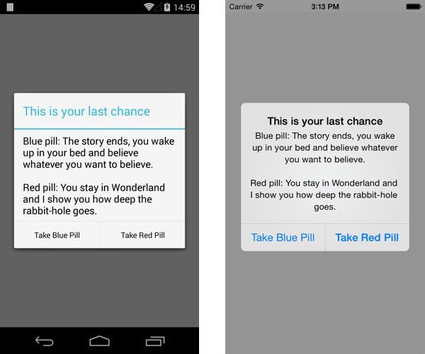

## Native Dialogs

Dialogs on mobile devices are a common pattern to force user input. While the SWT API provides dialogs already, they are not the best choice for a mobile device. SWT dialogs are shell based. This means they can't use the OS dialog. To use native dialogs in Tabris, the `ClientDialog` API exists.

## 

ClientDialog

The `ClientDialog` type is the abstraction of native dialogs. You can create one, set its title and message, add buttons, open and close it. To create a dialog like in the screenshot above, the code might look like this:

```
ClientDialog dialog = new ClientDialog();
dialog.setTitle( "This is your last chance" );
dialog.setMessage( "Blue pill..." );
dialog.setButton( ButtonType.OK, "Take Blue Pill", new Listener() {

  @Override
  public void handleEvent( Event event ) {
    System.out.println("Blue Pull taken" );
  }

} );
dialog.setButton( ButtonType.CANCEL, "Take Red Pill", new Listener() {

  @Override
  public void handleEvent( Event event ) {
    System.out.println("Red Pull taken" );
  }

} );
```

As you can see you can set buttons on a ClientDialog. A dialog can have up to three buttons. The buttons are typed with `OK, CANCEL and NEUTRAL.` It's up to the client to decide where those buttons should be displayed. When a button is pressed, its associated `Listener` will be called.

## Open and Close

To open or close a ClientDialog you just need to call the `open` or `close method`.

```
ClientDialog dialog = new ClientDialog();
...
dialog.open();
```

On some platforms it's possible to close a dialog without pressing a button on it e.g. by pressing into the background. In those cases it might be of interest to get notified about open and close events. You can keep track of those events with a `ClientDialogListener`:

```
ClientDialog dialog = new ClientDialog();
...
dialog.addClientDialogListener( new ClientDialogListener() {

  @Override
  public void open() {
    System.out.println( "Dialog was opened" );
  }

  @Override
  public void close() {
    System.out.println( "Dialog was closed" );
  }
} );
```
