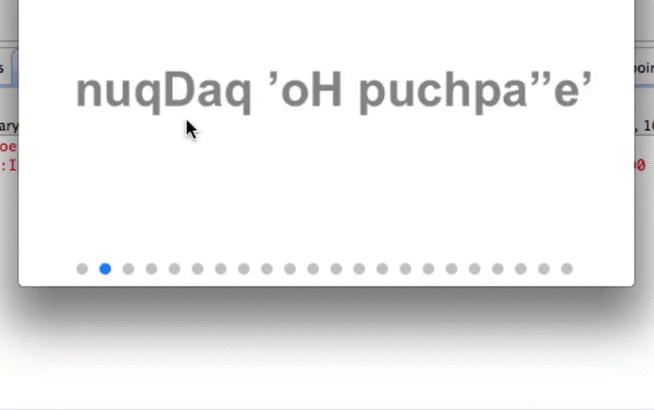

## Paging Indicator

When you build your app with a paging concept using [Swipe](https://eclipsesource.com/products/tabris/eclipse-rap-documentation/swipe-3/), [Tabris UI](https://eclipsesource.com/products/tabris/eclipse-rap-documentation/tabris-ui/) or any homebrew solution it's sometimes required that you need to indicate the paging progress. This is often done using colored bullets. To support this Tabris comes with a component called `PagingIndicator`.



## Creating a PagingIndicator

A `PagingIndicator` is just a simple control. So, you create it as you create any other control. It also needs to be layouted within its container. One difference is that the `PagingIndicator` does not need any style flags.

```
PagingIndicator indicator = new PagingIndicator( parent );
```

## Controlling the PagingIndicator

To work properly the `PagingIndicator` needs two information. These are how many bullets should be visible and which one is active. You can do this by calling the responsible set methods on the `PagingIndicator` instance:

```
PagingIndicator indicator = new PagingIndicator( parent );
indicator.setCount( 23 );
indicator.setActive( 1 );
```

This will show 23 bullets and make the bullet with the index 1 active.

## Personalization

The `PagingIndicator` allows you to control the active and inactive colors of the bullets, the spacing between bullets and the size of the bullets. You can configure this with the responsible set methods:

```
PagingIndicator indicator = new PagingIndicator( parent );
indicator.setActiveColor( activeColor );
indicator.setInactiveColor( inactiveColor );
indicator.setSpacing( 23 ); // set the spacing to 23px between bullets
indicator.setDiameter( 10 ); // set the diameter of a bullet to 10px
```

## Demo

A simple demo on how to use the `PagingIndicator` widget can be found on [github](https://github.com/eclipsesource/tabris-demos/blob/master/com.eclipsesource.tabris.demos/src/com/eclipsesource/tabris/demos/entrypoints/SwipeDemo.java).
