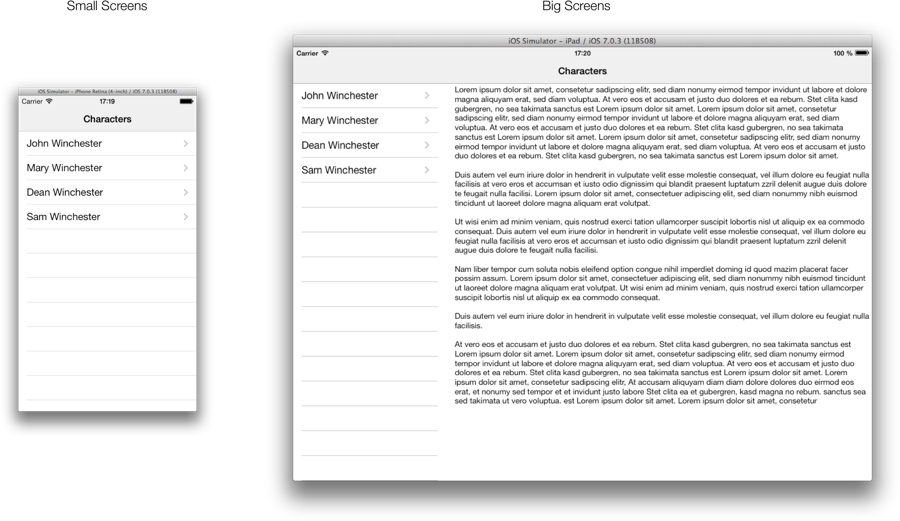
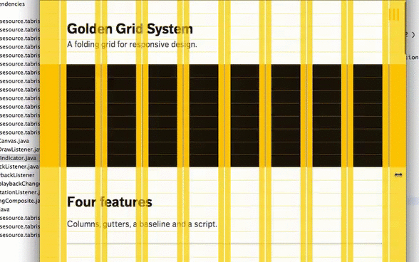
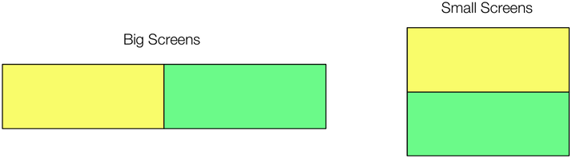

## Responsive Design

A common understanding of a [responsive design](https://en.wikipedia.org/wiki/Responsive_web_design) is a design that adapts itself to different screen sizes. With Tabris, you can develop applications for phones, handhelds or tablets. Those devices have all different screen sizes and thus need a special application layout. When creating HTML5 websites, an approach called fluid grids is heavily used to solve this problem. The basic idea behind this approach is that you layout the website as a grid and use [CSS media queries](https://en.wikipedia.org/wiki/Media_queries) to adopt bounds, fonts, images and so on. Sadly in Java, no concept like media queries exist.



## Passe-Partout

To solve this problem in Tabris, we ship a small library called "Passe-Partout". Basically, it allows you to create a responsive design using the same concepts as in the web. Passe-Partout has two main features:

- **Layouting:** It defines facilities to allow your application layout to be responsive.
- **Resources:** A responsive design does not only need to adjust its layout. It also needs to adjust resources like fonts, colors, and images.

_The whole Passe-Partout API is defined in one class called_ **PassePartout**. _Every method call described in this document, is made to a method defined in this class using_ [static imports](https://docs.oracle.com/javase/1.5.0/docs/guide/language/static-import.html). _To use Passe-Partout efficiently, you need to know how to deal with static imports in your favorite IDE._

## Layouting

When writing Tabris applications, you will write code using the SWT API. SWT knows a concept called [Layouting](https://www.eclipse.org/resources/resource.php?id=242). The drawback with the standard SWT layouts is that they are made for desktop applications that do not need to adjust when the screen size changes. For this reason, Passe-Partout defines a custom SWT layout called FluidGridLayout and custom layout data called `FluidGridData.`

## FluidGridLayout

With the FluidGridLayout you can structure your application as a grid that is responsive to size changes. The idea of how this grid works is borrowed from the famous [Golden Grid System (GGS)](https://goldengridsystem.com/) created by [Joni Korpi](https://www.jonikorpi.com/). Basically the GGS splits you visible area into several columns that adjust their widths while the screen size changes. What makes the GGS special is that it defines a concept called column folding. This concept comes from the print world. The idea is that on very large screens you will have 16 columns to use. On smaller screens, this number changes to 8 and on tiny screens like phone displays you only have 4 columns left. The image below shows what folding means.



The Passe-Partout `FluidGridLayout` works excactly like the GGS. To compute how many columns should be used the FluidGridLayout measures the width of your parent composite. The following defaults are defined:

- **0-720px:** 4 Columns.
- **720-1872px:** 8 Columns.
- **1872-∞px:** 16 Columns.

Creating and applying a FluidGridLayout is pretty simple:

```
Composite composite = new Composite( parent, SWT.NONE );
composite.setLayout( createFluidGrid() ); // As said before, this method is defined in the class PassePartout and imported with a static import
```

This snippet uses the method `PassePartout.createFluidGrid()` to create a FluidGridLayout with a default configuration. Default configuration means it uses the values described above for the column folding and the `LayoutMode.AUTO. AUTO` means it does automatically do a relayout when the size of the composite that uses this layout changes. You can also override the default configuration using the PassePartout`.`createFluidGrid`( FluidGridConfiguration configuration )` method. Within `FluidGridConfiguration` you can define the `LayoutMode` and the values used for the folding.

## FluidGridData

If you are familiar with SWT layouts you know that many layouts need their children to define layout data. If not please [read this now](https://www.eclipse.org/resources/resource.php?id=242). When using `FluidGridLayout` you need to set a custom layout data on the children of the composite that uses the FluidGridLayout. This layout data has to be of the type `FluidGridData`.

When creating responsive websites you will use media queries to defines the bounds of your child elements. Sadly in Java, no such thing like media queries exist. That's the reason the FluidGridData works with rules. Basically a Rule consists of conditions and instructions. It's almost the same as with media queries. You need to define the condition e.g., the minWidth of the parent element and afterward coupling an instruction e.g., the height to use.

To sum it up a Rule is a set of conditions and instructions that define the bounds of your control for different screen sizes. Let's do a simple example by taking a look at the image below.



The image shows a simple responsive application. It defines two areas (yellow and green) which should be placed side by side on large screens and stacked on small screens. To achieve this with `FluidGridData` we can use this code:

```
Composite parent = new Composite( parent, SWT.NONE );
parent.setLayout( createFluidGrid() );

Composite yellow = new Composite( parent, SWT.NONE );
yellow.setLayoutData( createFluidGridData(
  when( minWidth( px( 720 ) ) ).then( columns( 4 ) ),
  when( maxWidth( px( 719 ) ) ).then( columns( 4 ) )
) );

Composite green = new Composite( parent, SWT.NONE );
green.setLayoutData( createFluidGridData(
  when( minWidth( px( 720 ) ) ).then( columns( 4 ) ),
  when( maxWidth( px( 719 ) ) ).then( columns( 4 ) )
) );
```

As you can read in the code, we create two composites named yellow and green. Those composites get a `FluidGridData` as layout data with two rules. The first one says, that if the parent's width is 720px minimum it should use 4 columns out of 8 (remember folding). The second rule says that it should use 4 columns (out of 4) when the parent's width is 719px maximum.

In this example, we have defined a rule which consists only of one condition and one instruction. To define more complex layouts, you can combine them as you like. Conditions can be combined using `when( ... ).and( ... )`. Instructions can be combined using `then( instruction_1, instruction_1, ... )`.

To ease things Passe-Partout comes with a set of built-in conditions and instructions. For layouting these are:

- **Conditions:** minWidth, maxWidth
- **Instructions:** columns, height, margins, exclude

## Units

You may have noticed that we have used a thing called `px` in the last code example. This is because Passe-Partout defines units similar to CSS. When creating CSS based layouts you can use several units like pixels, points or percentages to define bounds. Anyway, in Java, we only have primitives like int, double and so on. For this reason, Passe-Partout defines a type called `Unit`. Out-of-the-box Passe-Partout knows three units: [pixel, percentage and em](https://www.w3.org/Style/Examples/007/units.html).

- `PassePartout.px( int ):` Creates pixels.
- `PassePartout.percentage( double ):` Creates a percentage.
- `PassePartout.em( double ):` Creates an em.

Every time you work with conditions and instruction you need to use units.

## Responsive Resources

As mentioned earlier layouting only is not enough to create a responsive application. You also need to adjust fonts, colors, and images. For this reason, Passe-Partout defines a concept called `Responsive Resources`. The idea is to use the same rules you are using for the `FluidGridData` to define the resources. A responsive resource is just another instruction. To make this clear let's read this sentence: "When the screen size has changed to 720px minimum width I want to set this image. Otherwise, I want to set the other image". See, "set this image" is just an instruction.

Knowing this we can do exactly what we defined in this example sentence using code:

```
Label label = new Label( parent, SWT.NONE );
createResource(
  when( minWidth( px( 720 ) ) ).then( image( largeImage ) ),
  when( maxWidth( px( 719 ) ) ).then( image( smallImage ) )
).bindTo( label );
```

## Adaptive Content

Sometimes it's not enough to just use a responsive layout and responsive resources. Some use cases require that we exchange small parts of our application when a specific condition is fulfilled. For this reason you can attach a `QueryListener` to a FluidGridLayout to get notified when such a query becomes active. This looks like this:

```
FluidGridLayout grid = createFluidGrid();
grid.addQueryListener( when( minWidth( px( 720 ) ) ), new QueryListener() {

  @Override
  public void activated( Query query ) {
    // create controls
  }

  @Override
  public void deactivated( Query query ) {
    // destroy controls
  }
} );
```

As you can see we are using the same query as in the previous examples to define a query we are interested in using the same API. A listener will be notified once query become active and once it will become inactive.
