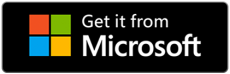
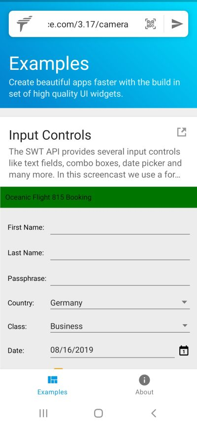

## Running a Mobile Client

To make it really easy, install our Tabris App Launcher from the Google PlayStore, App Store and Microsoft.

    

After starting the app, you have to enter the URL of the server you created in the previous step. All Tabris applications are accessible using a URL. For this reason, a client (iOS, Android or Browser) needs to know this URL to be able to display the UI. Make sure your server-side application is running. By clicking the "Start" button, the app will connect to the server and launch.

