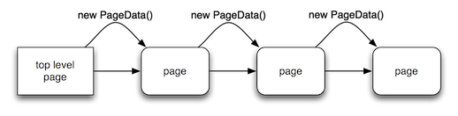

## Tabris UI

If you have used the `tabris-application` Maven archetype, you have already used Tabris UI, too. Tabris UI is a small UI framework on top of widgets. Basically, it's an abstraction of navigation concepts that each client can render the way it's common for the underlying platform. Using the Tabris UI, you can create nice looking applications like the ones below.


This guide will introduce you to the idea, concepts and the programming model of the Tabris UI. The example used in this section is a bookstore app that [can be found](https://github.com/eclipsesource/tabris-demos/tree/master/com.eclipsesource.tabris.demos/src/com/eclipsesource/tabris/demos/ui) on GitHub. It's licensed under the [EPL 1.0](https://www.eclipse.org/legal/epl-v10.html), so feel free to use it as a starting point for your application.

## Idea

The basic idea behind Tabris was always to use the [SWT Java API](https://eclipse.org/swt) to create UIs for mobile devices. This idea hasn't changed much. But the problem is that widgets are not enough to create apps with a high UX. Each platform has it's own navigation concepts. For Android, this is the ActionBar, and for iOS, it is the View Controllers as highlighted in the screenshot below.


With plain widgets, it's not possible to create a UI using those concepts. So, the basic idea behind the Tabris UI is to provide an abstraction for those concepts. In other words to create a Java API that is common for all platforms but can be rendered using the native facilities of each platform.

## Abstraction

Tabris is a framework for cross-platform mobile apps. The basic concept of Tabris is that you write the UI in Java and it runs on the server. A device calls the server and renders your UI with native components. This means that when you create an SWT Button on iOS, an iOS button will be created and on Android, an Android button will be created. As a result, you can create applications with one code base that serves multiple platforms. This means that we can't (and don't want to) port the concepts of the different platforms to a server-side API. We have to create an abstraction! That is an encapsulation of the concepts of all platforms into a simple, understandable API. This API is called "Tabris UI". The key parts are two types, `Page` and `Action`. To make it clear what these types are we can take a look at another image.


The red shaded area of these images is the `Page` which basically contains your controls. In the green shaded boxes, you can see two Actions. An `Action` is an element that a user can press (to activate) and which is located outside of the `Page`.

## Concepts

Let's look a little deeper into Pages and Actions. Pages can be chained together in any order. This means, a user's button click can be used to open a new page. When you do this multiple times a chain will be created. Within this chain, you will be able to browse backward to the previous page. This concept is called page chaining. Every chain has a root element. This is what we call the `top level` page. One application can have multiple top level pages and all can mark the beginning of a chain. Let's take a look at a diagram.


This diagram could represent almost any application. The usual flow of an application is that you start on a top level page and browse through several pages aka going deeper into the application. As you can see on the image this is what we call chaining. But one top level page is not enough for most applications.

Think about a bookstore application. The possible top level pages are "All Books", "Favorites", "Popular Books". Each top level page will contain another set of books you can browse through. So, when you have several top level pages you need to be able to browse from one top level page to another or to browse from a normal page to a top level page. This is shown with the red arrows on the diagram.

What's not possible is to navigate from one page in a chain to a page in another chain because only one chain can exist at any given time. The pages in a chain are created when they are visited and they will be destroyed when you navigate in reverse and leave them (e.g., when you jump back to the top level page or the previous page).

Actions have a lifecycle similar to Pages. Similar but not exactly the same. Two types of Actions exist. Global Actions and Page Actions. A Global Action is visible regardless of which page the user is on. Page Actions exist only on a specific page. They are created when the page is created and will be destroyed when the page is destroyed. You can see the difference in the following screenshots. In these images the Global Action is shaded in green. It has application scope. The Page Action is shaded red. It has page scope.


##  Programming Model

You will find yourself creating Page and Action objects to enable the main functions of your applications. Doing this is just extending `AbstractPage` or `AbstractAction` (you can also implement the interfaces `Page or Action`). When implementing an `AbstractPage` you can open other pages by simply calling `openPage( String pageId )` which will open the page with the given id.

In most cases you will quickly reach a point where the components need to communicate. Of course, you can access a Page directly from within an Action or another Page but this is not a good practice. We prefer loosely coupled communication between components. This communication can be accomplished by using `PageData`. When we talk about page data, think about a simple `Map`, encapsulated in the type `PageData`. A `PageData` object has the same lifecycle as a page. Each page has its own data, even top level pages. This is because you will need to pass data in your chain. You can navigate to a new page and pass in a `PageData` object which then marks the page data of the new page. Let's take a look at another diagram.



As you might notice it shows the same page chain as above. What's different is that it shows the new `PageData` objects that will be passed to a new page. In this data, you can save page state information such as a selection. You can pass in data by simply calling `openPage( String pageId, PageData data )` in your AbstractPage implementation. You can also call this open method from within an `AbstractAction`.

_Please note, when using the interfaces_ `Page` _and_ `Action` _you need to call the open methods on the UI. The abstract classes just provide convenience methods._

## Configuration

What we have not described in the preceding paragraphs is how the different components come together. This is all done via configuration. To be explicit, the type that matters is called `UIConfiguration`. You will need to create an instance and add the configuration of your Pages and Actions to it.

What are Page and Action configurations? As the name says, they are the configurations of a Page or an Action. A Page doesn't know anything about its title, its content or if it's a top level page. And this is the same for Actions. This information needs to be declared within a `PageConfiguration` or `ActionConfiguration` object. The diagram below shows how this works.


As you can see, the Tabris UI framework is responsible for creating Page and Action objects out of the configuration. This also means that you will need to add `Page` or `Action` Class objects to its `UIConfiguration`. Typically creating such a configuration looks like this:

```
UIConfiguration configuration = new UIConfiguration();

	PageConfiguration page = new PageConfiguration( "all-books", AllBooksPage.class )
	                          .setTitle( "All Books" )
	                          .setImage( AllBooksPage.class.getResourceAsStream( "all-books.png") ) )
	                          .setTopLevel( true );
	configuration.addPageConfiguration( page );

	ActionConfiguration action = new ActionConfiguration( "search-action", BookSearchAction.class )
	                              .setImage( AllBooksPage.class.getResourceAsStream( "search.png") )
	                              .setTitle( "Search" );
	configuration.addActionConfiguration( action );
```

In this example two configurations will be created and added to a `UIConfiguration`. The first one is a PageConfiguration which defines a `top level` page with the id "all-books" and the class `AllBooksPage.class`. This page will have a title called "All Books" and an image that is on the classpath with the name "all-books.png". The second configuration is an `ActionConfiguration` that defines a global action because it's added to the `UIConfiguration`. If you want to create a page action you need to add the `ActionConfiguration` to the `PageConfiguration` where you want to have the action.

The usual place were such a `UIConfiguration` will be created is in the `configure` method of an `ApplicationConfiguration`. An `ApplicationConfiguration` is used to configure RAP applications, [see the RAP developer guide for more details.](https://eclipse.org/rap/developers-guide/devguide.php?topic=application-configuration.html&version=2.2)

Within this configure method you will add an `EntrypointFactory` called `TabrisUIEntryPointFactory` to Application. This factory has one argument and this is the `UIConfiguration`.

## Action Placement

When working with actions it's sometimes necessary that a special action has a higher priority than others. Think about a store application. Probably a search action would have the highest priority. For this reason, such high priority actions should be displayed at a very prominent position e.g., on the top toolbar on iOS. In Tabris UI you can use `PlacementPriorities`. The screenshot below shows how the Android and iOS client interpret placement priorities. The green area is used to position high priority actions and the red/orange area is used to render low priority actions.


To use placement priorities you can just add them to the ActionConfiguration like in the snippet below:

```
ActionConfiguration action = new ActionConfiguration( "search-action", BookSearchAction.class )
	                              .setImage( AllBooksPage.class.getResourceAsStream( "search.png") )
	                              .setTitle( "Search" )
	                              .setPlacementPriority( PlacementPriority.HIGH )
```

## Examples

As an example, we have created the already mentioned bookstore application using Tabris UI.


The code can be [found on github](https://github.com/eclipsesource/tabris-demos). Below are links to the most important resources to look into:

- [The Java package containing the demo](https://github.com/eclipsesource/tabris-demos/tree/master/com.eclipsesource.tabris.demos/src/com/eclipsesource/tabris/demos/ui)
- [An example UIConfiguration](https://github.com/eclipsesource/tabris-demos/blob/master/com.eclipsesource.tabris.demos/src/com/eclipsesource/tabris/demos/entrypoints/UiDemo.java)
- [An example AbstractPage](https://github.com/eclipsesource/tabris-demos/blob/master/com.eclipsesource.tabris.demos/src/com/eclipsesource/tabris/demos/ui/BookDetailsPage.java)
- [An example AbstractAction](https://github.com/eclipsesource/tabris-demos/blob/master/com.eclipsesource.tabris.demos/src/com/eclipsesource/tabris/demos/ui/ShareAction.java)
