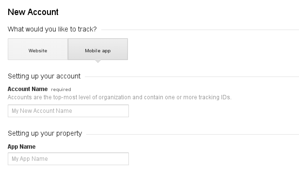
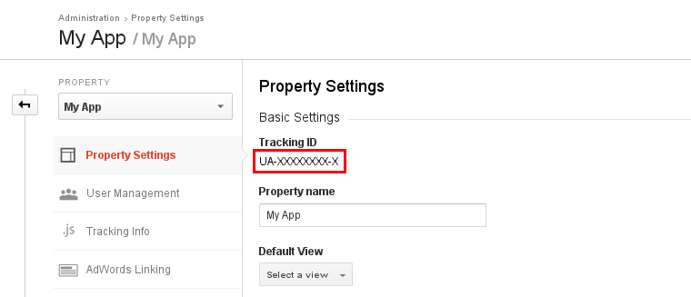
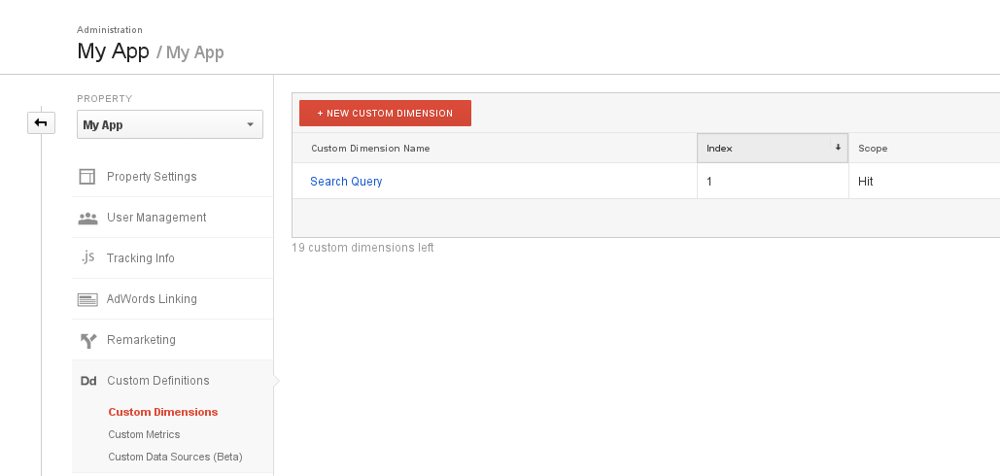
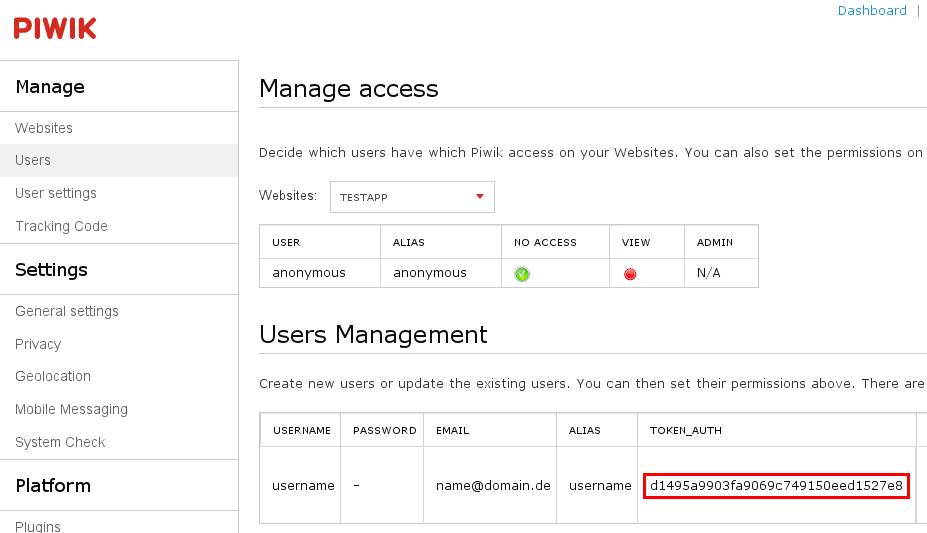
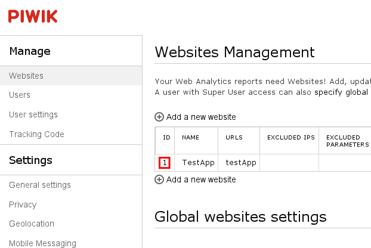

## Tracking

Collecting relevant usage data can be one of the most useful ways to improve your app's usability and make customers happier. With Tabris, it's pretty easy to do that - using your favorite analytics platform. And it's as easy as that:

```
private UIConfiguration createConfig() {
 UIConfiguration configuration = new UIConfiguration();
 GoogleAnalyticsTracker analytics = new GoogleAnalyticsTracker( "UA-XXXXXX-XX", "Application Name" );
 PiwikTracker piwik = new PiwikTracker( "https://localhost/piwik/piwik.php", "tokenAuth", 1 );
 Tracking tracking = new Tracking( googleAnalytics, piwik );
 tracking.attach( configuration );
 ...
```

We've created an API, which allows you to easily track user activity without having to bloat your application code with tracking platform method invocations. The tracking happens on the server side and runs asynchronously, which means that it won't affect the client bandwidth usage or overall app performance. You just create an instance of a `Tracking` and pass the UI configuration to it. It accepts multiple `Trackers` as arguments.

Trackers have access to useful information about the client such as the device vendor, model, OS version, resolution, locale, timezone, and the IP address. They are also being provided with page/action-specific data and search queries.

## The Tracker

`Tracker` is an interface with just one method: `handleEvent( TrackingEvent event )`. TrackingEvents can be a page view `(EventType.PAGE_VIEW)`, an action `(EventType.ACTION)`, a search `(EventType.SEARCH)`, an order `(EventType.ORDER)` or a custom event `(EventType.EVENT)`. They also get a `TrackingInfo` with the information that will be extracted from the device, a `detail` Object for abstract data (we use it to inject the PageConfiguration and ActionConfiguration ids) and the current timestamp.

`PAGE_VIEW` events get triggered after the page is completely shown - after the page transition is complete. `ACTIONS` get sent on action hits (Actions implementing `AbstractAction` from com.eclipsesource.tabris.ui.action) and `SEARCH` gets triggered when performing a search (on `SearchAction` search method invocation with the query parameter). Orders and custom events must be submitted manually with the associated `submit` methods of the `Tracking`.

We have already implemented trackers for the most popular tracking platforms. We'll try to clarify the platform specifics in the sections below.

## Google Analytics

To begin you should first create a mobile app Google Analytics account.



## On the Tabris Side

Google Analytics tracker accepts two `String` arguments: **trackingId** and **appName**. The tracking id is visible under Admin -> Property Settings:



_AppName_ is your Tabris app name.

## On the Google Analytics Side

Hit Types

- **PAGE\_VIEW**

The `PAGE_VIEW` is interpreted as a screenview hit. It's important that you've created a mobile app Google Analytics account or else the screenview hit won't get tracked.

- **ACTION**

The `ACTION` hit is interpreted as an event hit in Google Analytics. The event category is tabris.ui.action, the event action is executed and the event label is the name of the action class. For example, selecting the settings action item in our UI book app demo would show up with this label in the Google Analytics interface: com.eclipsesource.tabris.demos.ui.SettingsAction.

- **SEARCH**

`SEARCH` is an event hit with the category tabris.ui.action.search, action execute and label name the name of the SearchAction class. With our book app UI demo it will look like this: com.eclipsesource.tabris.demos.ui.BookSearchAction.

The Measurement Protocol, unfortunately, doesn't provide methods to specifically track mobile app searches, so we've chosen to send search queries as custom dimensions together with the event hit request.

Google Analytics doesn't automatically create the custom dimension for you, so you should first create it yourself.



The custom dimensions setup interface is accessible under Admin -> Custom Dimensions -> Custom Definitions. The search query custom dimension should have the scope Hit. If its index is not 1, you should change the `int searchIndex` field assignment in the `GoogleAnalyticsTracker` class' constructor.

You can select your custom dimension as a secondary dimension in most reports, but to be most flexible we recommend setting up a custom report.

- **ORDER**

The `ORDER` event is interpreted as an ecommerce hit in Google Analytics. For this reason you can see it after a[ctivating ecommerce tracking](https://support.google.com/analytics/answer/1009612?hl=en) for your app.

- **EVENT**

The `EVENT` hit is interpreted as an event hit in Google Analytics. The event category is tabris.event, the event action is custom and the event label is the `eventId` you've submitted by calling the `submit` method.

## Piwik

On the Tabris Side

PiwikTracker accepts 3 arguments:

| **Parameter** | **Type** | **Description**                                       |
|    :----:     |  :----:  |      :----:                                           |
| piwikUrl      | String   | The absolute URL to piwik.php.                        |
| tokenAuth     | String   | Your Piwik user’s TOKEN_AUTH.                         |
| siteId        | int      | This is the id of the site entry for your Tabris app. |

You can see your user's `TOKEN_AUTH` under Settings -> Users -> Users Management.



The site ID is listed in the websites table under Settings -> Websites -> Websites Management.



## On the Piwik Side

Screen views are treated as actions in Piwik. Every action has a URL, which has to be sent along with the request. Because Tabris actions can't have a URL assigned, we are sending a fake host, consisting of the appId, according to [this Piwik official blog post recommendation](https://piwik.org/blog/2012/04/how-to-use-piwik-to-track-mobile-apps-activity-clicks-phones-errors-etc/) and a simple path, which will help you recognize the action type.

- **PAGE\_VIEW**

`PAGE_VIEWs` are just actions with the actionUrl `https://appId/page/pageId,` e.g. for our book app UI demo it would look like this: `https://com.eclipsesource.tabris.developer/page/com.eclipsesource.tabris.demos.ui.AllBooksPage`

- **ACTION**

`ACTIONs` are actions with the actionUrl `https://appId/action/actionId`. Our book app UI demo example: `https://com.eclipsesource.tabris.developer/action/com.eclipsesource.tabris.demos.ui.SettingsAction`

- **SEARCH**

SEARCHes are search actions with actionUrl following this URL scheme: `https://appId/action/search/searchActionId`. Searching in our book app UI demo with Piwik tracking enabled would result in the following URL being logged: `https://com.eclipsesource.tabris.developer/action/search/com.eclipsesource.tabris.demos.ui.BookSearchAction`

Note: The action URL for search actions doesn't appear to be shown on the Piwik interface.

- **ORDER**

The `ORDER` event is shown as an ecommerce order in Piwik. You should first [enable the Ecommerce setting for your website.](https://piwik.org/docs/ecommerce-analytics/#enable-ecommerce-tracking)

- **EVENT**

The `EVENT` hit is interpreted as an event action in Piwik. The event category is tabris.event, the event action is custom and the name is the eventId you submit by calling the submitEvent method.

## Additional Information Being Sent to Piwik

We also send the following information as custom variables:

- Application Version
- Device Model
- Device OS Version
- Device Vendor
- Locale

## Console

For debugging purposes, as template or if you intend to log console events you can also add a ConsoleTracker. What it does is simply output basic tracking information to the console.

This is an example of simple app usage being logged - launching the book app UI demo, selecting the search action, searching for "Schroder" and hitting search, which leads to the Schroder book page being opened.

```
PAGE_VIEW - com.eclipsesource.tabris.demos.ui.AllBooksPage (All Books) [com.eclipsesource.tabris.developer, GT-I9000, samsung, 4.4.2]
ACTION - com.eclipsesource.tabris.demos.ui.BookSearchAction (Search) [com.eclipsesource.tabris.developer, GT-I9000, samsung, 4.4.2]
PAGE_VIEW - com.eclipsesource.tabris.demos.ui.BookDetailsPage (Book) [com.eclipsesource.tabris.developer, GT-I9000, samsung, 4.4.2]
SEARCH - query=schroder [com.eclipsesource.tabris.developer, GT-I9000, samsung, 4.4.2]
```
