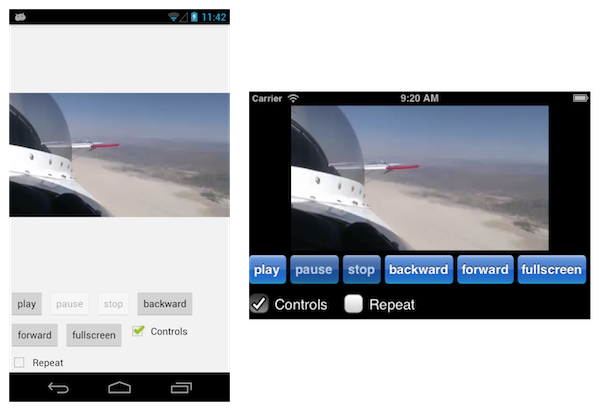

## Video

Tabris provides a Video widget that can be used to play any kind of video on the client's device. It also provides facilities to control the playback or zoom.



## Load a Video

Loading a video is pretty simple. The only thing you need is the URL of the video e.g. the YouTube URL. With this you can simply create a new `Video` object and pass in the URL:

```
Video video = new Video( "https://my-video-url.foo", parent );
```

After creating the `Video` a user can start, stop, forward, backward, zoom and pause the video playback. You can also do this by calling the control methods on the `Video` directly.

## Get User Interactions

While the user can control the video, it would be nice to get notified when he does it. E.g. getting notified when he pauses or zooms the video. For this reason, you can attach two listeners to a `Video: PlaybackListener` and `PresentationListener`. The playback listeners will be called when the user controls the playback of a video e.g. play, pause and so on. The presentation listener will be called when he changes the view mode e.g. toggles fullscreen.

```
Video video = new Video( "https://my-video-url.foo", parent );
video.addPlaybackListener( new PlaybackListener() {

  @Override
  public void playbackChanged( Playback newPlayback ) {
    // do something
  }
} );
video.addPresentationListener( new PresentationListener() {

  @Override
  public void presentationChanged( Presentation newPresentation ) {
    // do something
  }
} );
```

## Forbid User Interaction

Sometimes it's needed to disable the ability to control the video. For this reason you can hide the built-in video player controls:

```
Video video = new Video( "https://my-video-url.foo", parent );
video.setPlayerControlsVisible( false );
```

## Demo

A simple demo on how to use the `Video` widget can be found on [github](https://github.com/eclipsesource/tabris-demos/blob/master/com.eclipsesource.tabris.demos/src/com/eclipsesource/tabris/demos/entrypoints/DrawDemo.java).
