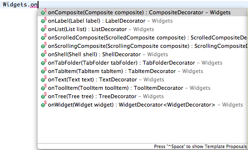
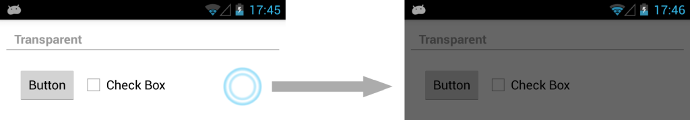

## Widget Enhancements

Tabris uses the SWT API as its programming model. This means you will use the well-known SWT widgets like Buttons, Trees and Tables. The drawback using these Widgets is that they are not optimized for mobile devices because they were made for the Desktop. Nevertheless, this does not outstand the benefit that you can reuse your code on multiple platforms. But coding a mobile UI requires widgets that are made for mobile platforms. So, we have a problem here. The solution we provide is called Widget Enhancements. It's an API that decorates the existing widgets to fulfill the requirements for mobile UIs.

## Widgets...

The entrypoint for the Widget Enhancements API is the `Widgets` class. This class provides methods that start always with onSomething, e.g. `onShell` or `onTree`. Those methods take the actual widget as an argument and return a decorator for this widget. The decorators provide a fluent API. Let's take a look at an example:

```
Text text = new Text( new Shell(), SWT.NONE );
Widgets.onText( text ).usePhoneKeyboard().showLocalTouch()
```

This snippet enhances a `Text` widget to show the phone keyboard when it gains focus and to provide immediate touch feedback when it's clicked. You can see all the enhanced widgets by using your favorite IDE's content assist.



Most of the enhancements are widget specific. E.g. using another keyboard layout on a `Text` field or setting a badge on a `TabFolder`. Besides those widget-specific enhancements, common ones also exist.

_Tip: If you use static imports for the_ `Widgets` _class your code will be more readable. Instead of_ `Widgets.onWidget( widget ).showLocalTouch();` _you will use_ `onWidget( widget ).showLocalTouch();`

## Local Touch

While there is no mouse on a mobile device, it's sometimes necessary to show local touch feedback on a widget. Again think about a composite with a `MouseListener`. When you touch the composite, it would be nice to have some kind of local feedback that shows that this `Composite` was touched and something will happen soon. Using local touch is also pretty easy and works on every widget:

```
Widgets.onWidget( widget ).showLocalTouch()
```



## Text manipulation

Text fields are heavily used in a mobile app. Some platforms provide capabilities to manipulate the text you type in e.g. auto correction. You can enable/disable auto correction by calling `Widgets.onText( text ).setAutoCorrectionEnabled( true/false)`. You also have the option to disable/enable auto capitalization by invoking `Widgets.onText( text ).setAutoCapitalization( AutoCapitalization.ALL/AutoCapitalization.NONE).`

One of the more advanced features is the text replacement feature. You can define shortcuts for single text fields. When a user types the shortcut a suggestion will be shown that lets the user replace the typed shortcut. An example can look like this:

```
TextReplacementData data = new TextReplacementData();
data.put( "yolo", "You only live once" );
data.put( "hodor", "hodor hodor hodor" );
data.put( "lol", "laughing out loud" );
Widgets.onText( text ).setTextReplacement( data )
```

## Demo

To see the enhancements in action you can browse through the official Tabris demo. The enhancements are used all over it. The demo can be found on [github](https://github.com/eclipsesource/tabris-demos/).
